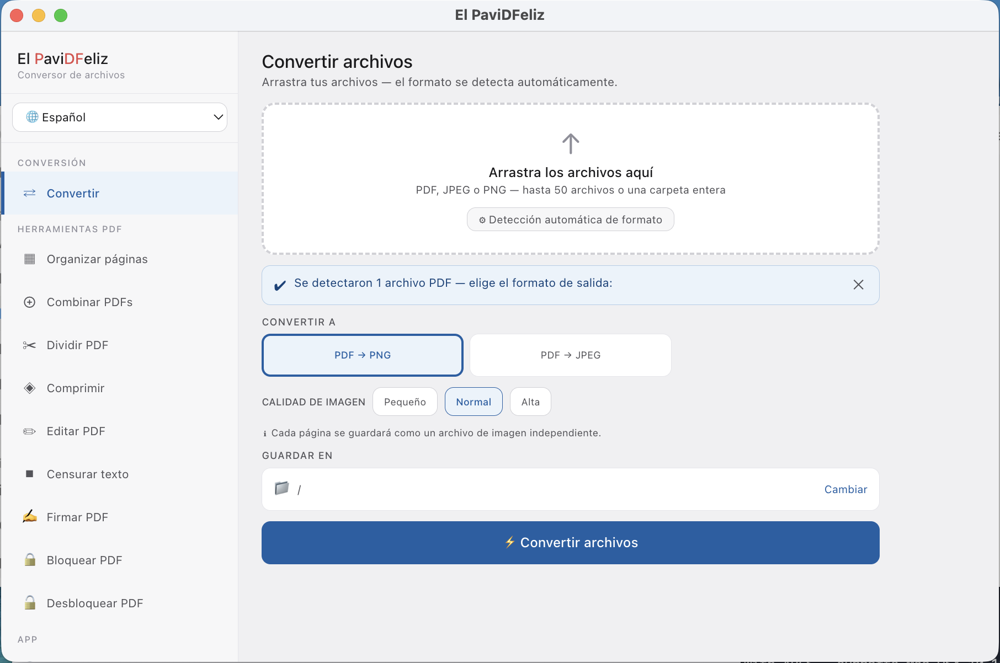

# El PaviDFeliz

**Offline-first PDF and image toolkit for macOS and Windows.**  
No subscriptions. No internet connection. No data leaves your machine.



---

## Features

| Tool | What it does |
|------|-------------|
| **Convert** | PDF → PNG/JPEG, JPEG ↔ PNG, WEBP → PNG/JPEG, images → PDF |
| **Merge** | Combine multiple PDFs into one |
| **Split** | Split by page ranges, every N pages, or one file per page |
| **Compress** | Reduce file size for PDFs and images |
| **Organize** | Drag-to-reorder and delete pages with live thumbnails |
| **Edit** | Highlight, strikethrough, and text-box annotations |
| **Redact** | Draw black boxes over sensitive content, flattened permanently |
| **Sign** | Draw a signature on a canvas and stamp it onto a PDF page |
| **Lock / Unlock** | Password-protect or remove protection from PDFs |
| **History** | Log of all operations with reveal-in-Finder links |
| **Settings** | Output folder and language, persisted between sessions |

**Languages:** English · Español · 日本語 · 한국어

---

## Download

> Pre-built installers will be available on the [Releases](../../releases) page.

| Platform | File |
|----------|------|
| macOS (Apple Silicon) | `El PaviDFeliz-x.x.x-arm64.dmg` |
| macOS (Intel) | `El PaviDFeliz-x.x.x.dmg` |
| Windows | `El PaviDFeliz-Setup-x.x.x.exe` |

**macOS note:** The app is not yet notarized. On first launch, right-click the app → **Open** → click **Open** in the dialog. You only need to do this once.

---

## Tech Stack

| Layer | Technology |
|-------|-----------|
| Shell | Electron 35 |
| UI | React 19 + Vite 8 |
| IPC | `contextBridge` + `ipcMain.handle` |
| Backend | Python 3.13 worker (NDJSON over stdin/stdout) |
| PDF engine | pypdf 4 · pdf2image · Poppler · reportlab |
| Crypto | pycryptodome 3.20 |
| Bundling | PyInstaller 6 (`--onedir`) + electron-builder 25 |

All PDF and image processing runs in the Python worker process. The Electron shell handles the window, file dialogs, and IPC — it never touches file bytes directly.

---

## Build from Source

### Requirements

- **Node.js** 20+ and npm
- **Python 3.13** with a `.venv` virtual environment
- **Poppler** vendor binaries placed in `python/vendor/poppler/` (see below)
- A font file at `python/assets/fonts/DancingScript.ttf`

### Poppler vendor binaries

Pre-built Poppler binaries must be placed in the correct subdirectory before building:

```
python/vendor/poppler/
  macos-arm64/   ← binaries for Apple Silicon
  macos-x64/     ← binaries for Intel Mac
  windows/       ← binaries for Windows
```

See `python/vendor/poppler/README.md` for sources.

### Python environment

```bash
cd python
python3.13 -m venv .venv
.venv/bin/pip install -e .
.venv/bin/pip install -r requirements-dev.txt
```

### Build

```bash
# macOS (arm64 + x64 DMGs)
./build.sh

# Skip Python rebuild if worker is already built
./build.sh --no-py

# Windows x64 NSIS installer (run on Windows PowerShell)
powershell -ExecutionPolicy Bypass -File .\build-windows.ps1
```

Output is written to `electron/dist-electron/`.

### Windows handoff

Use the Windows machine for the Windows packaging phase. The exact setup, build, and validation steps are documented in [docs/windows-handoff.md](docs/windows-handoff.md).

### Dev mode (no installer)

```bash
# Terminal 1 — build renderer in watch mode
cd electron && npm run dev:renderer

# Terminal 2 — launch Electron
cd electron && npm start
```

---

## Project Structure

```
├── electron/
│   ├── src/              # Main process (main.js, preload.js)
│   └── renderer-src/     # React UI (screens, components, i18n)
├── python/
│   ├── src/pavidffeliz_backend/
│   │   └── operations/   # PDF and image operation handlers
│   ├── pyinstaller/      # PyInstaller spec files
│   └── vendor/poppler/   # Poppler binaries (not committed)
└── build.sh              # Top-level build script
```

---

## License

MIT — see [LICENSE](LICENSE).
